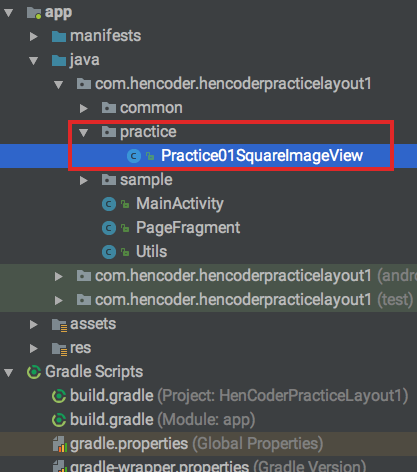
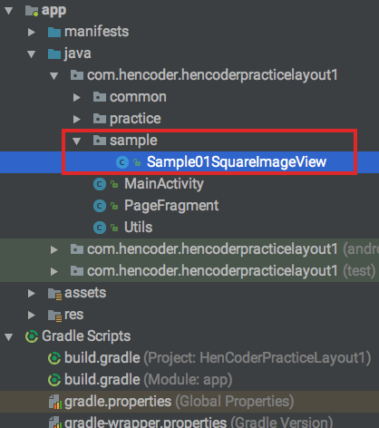

HenCoder 布局 1 修改已有控件的尺寸 练习项目
===

### 这是什么？

这不是一个独立使用的项目，它是 [HenCoder Android 开发进阶：UI 2-1 修改已有 View 的尺寸](http://hencoder.com/ui-2-1) 的配套练习项目。

### 怎么用？

项目是一个可以直接运行的 Android App 项目，项目运行后，在手机上打开是这样的：

工程下有一个 `/practice` 目录：

你要做的是就是，在 `/practice` 下的每一个 `PracticeXxxView.java`（嗯，这期只有一个练习内容） 文件中写代码，做出和上半部分的示例相同的效果。

如果做不出来，可以参考 `/sample` 目录下的代码：

练习做完，这期的内容也就掌握得差不多了。